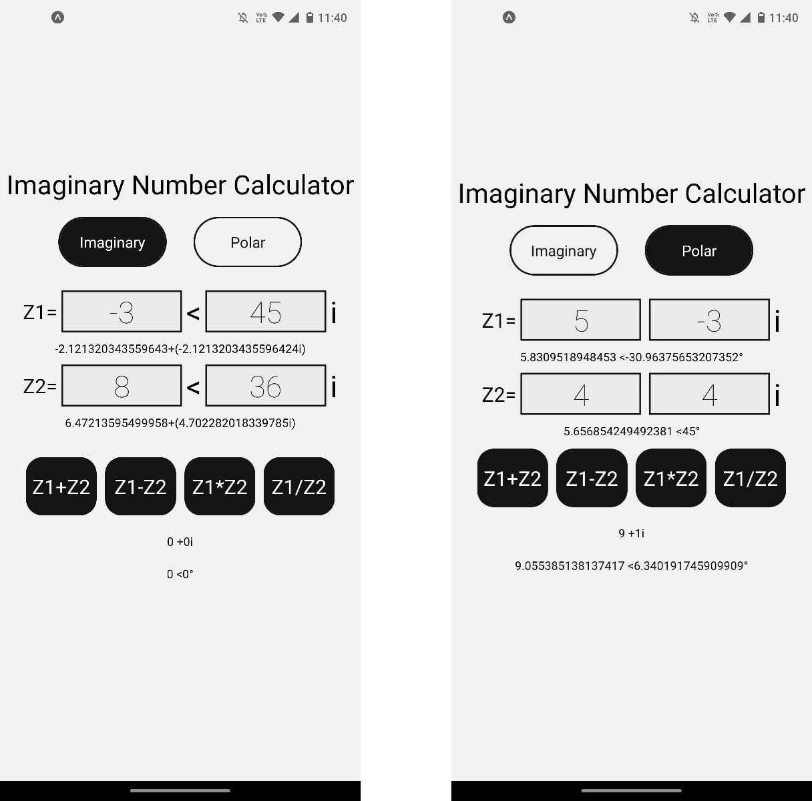

# Calculadora de número imaginário e polar

## Sobre
Esse é um aplicativo que calcula números imaginário e polar e converte um no outro

___

## Tecnologias 💻

-   [React Native](https://reactnative.dev/)
-   [Expo](https://expo.io)

___

### Baixe o App

[imaginary number calculator](https://play.google.com/store/apps/details?id=com.jacksonJKL.imaginary_number_calculator&hl=pt-BR)